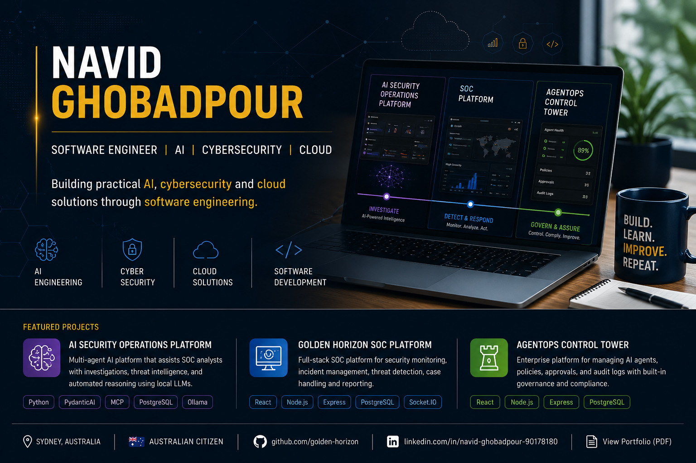

 

### Sydney, Australia

[📄 View Portfolio](https://github.com/golden-horizon/golden-horizon/blob/main/Navid_Ghobadpour_Portfolio.pdf) ·
[LinkedIn](https://www.linkedin.com/in/navid-ghobadpour-90178180) ·
[GitHub](https://github.com/golden-horizon)

---

## About

I'm an IT and Cyber Security graduate who enjoys building practical systems across artificial intelligence, cybersecurity, cloud infrastructure and software development.

My projects include a full-stack Security Operations Centre platform, an AI-assisted security investigation platform and an AgentOps Control Tower for managing AI agents, policies, approvals and audit activity.

I enjoy turning technical ideas into working applications and learning through building.

---

## What I've Built

### AI Security Operations Platform

An AI-assisted security investigation platform that combines local language models, threat intelligence, automated reasoning and multi-agent workflows.

**Technology:** Python · PydanticAI · MCP · PostgreSQL · Ollama

[View repository](https://github.com/golden-horizon/agentic-ai-security-operations-platform)

---

### Golden Horizon SOC Platform

A full-stack Security Operations Centre platform for security monitoring, incident investigation, threat detection, case management and reporting.

**Technology:** React · Node.js · Express · PostgreSQL · Socket.IO

[View repository](https://github.com/golden-horizon/golden-horizon-soc-frontend)

---

### AgentOps Control Tower

A governance platform for registering and managing AI agents, enforcing policies, reviewing approval requests and maintaining audit logs.

**Technology:** React · Node.js · Express · PostgreSQL

[View repository](https://github.com/golden-horizon/agentops-control-tower)

---

## Technical Toolbox

| Area | Technologies |
|---|---|
| Programming | Python · JavaScript · SQL |
| Frontend | React · HTML · CSS |
| Backend | Node.js · Express · REST APIs |
| AI | PydanticAI · MCP · Ollama · Agentic AI |
| Cloud | AWS · Docker · Linux |
| Database | PostgreSQL |
| Security | MITRE ATT&CK · Threat Detection · Incident Investigation |

---

## Certifications

- AWS Certified Solutions Architect – Associate
- ISC2 Certified in Cybersecurity
- Cisco Ethical Hacker
- OpenEDG Python Professional
- AMD AI Academy
- freeCodeCamp Responsive Web Design
- freeCodeCamp Relational Database

---

## Education

**Diploma of Information Technology — Cyber Security**  
TAFE NSW

**Certificate IV in Cyber Security**  
TAFE NSW

---

## Contact

- [LinkedIn](https://www.linkedin.com/in/navid-ghobadpour-90178180)
- [Professional Portfolio](./Navid-Ghobadpour-Portfolio.pdf)
- Email: navid77g@gmail.com
